실행 화면

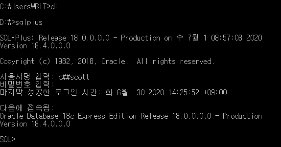

Index

\- 실제 물리적 메모리의 주소를 레퍼런스 해주는 것(?), 인덱스를 어떻게 구성하느냐에 따라 퍼포먼스가 달라짐

\- pK : 자동생성

\- Unique : 자동생성

\- 나머지는 DBA가 직접 만듦(WHERE절에 많이 쓰일만한 컬럼으로 정하는 것이 일반적 but 삽입 삭제와 같은 변경일 경우 성능이 떨어짐)

\- Talble scan(전체 스캔), Index scan

\- 복합키는 복합키 인덱스(2개로 되어있는 것)

Data Manipulation Language

\- 종류 : Add new rows...

\- 트랜잭션의 대상

INSERT

\- 묵시적 방법 : 컬럼 이름 순서 지정하지 않음, 테이블 생성시 정의한 순서에 따라 값 지정(DEFAULT 키워드로 해당 컬럼의 디폴트 설정 가능)

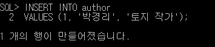

\- 명시적 방법 : 컬럼 이름 명시적 사용, 지정되지 않은 컬럼 NULL 자동 입력

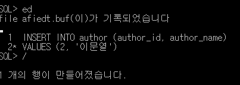

\- SubQuery 이용 : 타 테이블로부터 데이터 복사(테이블 존재해야 함)

INSERT INTO department\_usa

SELECT department\_id, department\_name

FROM departmnets

WHERE deprartment\_anme = 'IT';

\- CREATE TABLE AS SELECT : 없는 테이블을 생성 & 데이터 복사

UPDATE

\- 조건을 만족하는 레코드를 변경

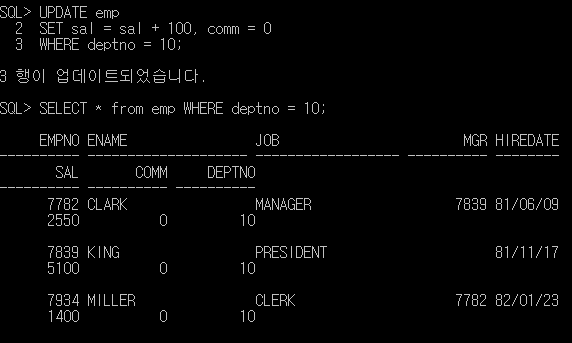

하지만 Rollback Segment로(캐시와 비슷한 것인 듯) 인해 2번 창에선 값 변경이 되지 않음

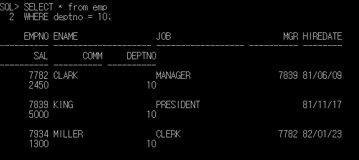

따라서 본 실행창에 COMMIT 또는 ROLLBACK 명령어로 롤백 세그먼트에 있는 내용을 커밋을 시키거나 지우거나 해야함 

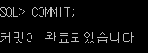

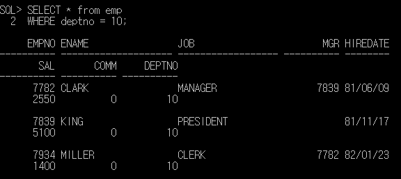

\- WHERE 절이 생략되면 모든 레코드에 적용

-Subquery를 이용한 변경

DELETE

\- 조건 만족하는 레코드 삭제

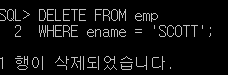

\- 조건 없으면 모든 레코드 삭제 됨

-Subquery를 이용한 DELETE

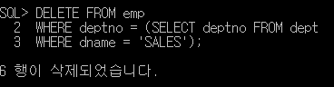

\- 이것도 롤백세그먼트의 영향을 받음

참고

\- 데이터 입력 수정 시 자주 사용되는Pseudo 컬럼 : USER, SYSDATE, ROWID

\- DEFAULT

\- DELETE와 TRUNCATE : 딜리트는 롤백 가능하지만 대량의 log등을 유발하므로 느림( TURNCATE는 롤백 없이 바로 삭제하는 대신 빠름)

\- 모든 DML문은 Integrity Constraint를 어길 경우 에러 발생

Transaction

\- 정의 : DB에서 하나의 작업으로 처리되는 논리적 작업 단위, DBMS의 Concurrency control과 Recovery에서 중요한 역할 수행

\- ACID Propert : Atomicity(하나의 단위로 처리), Consistency(데이터 베이스의 무결성 유지), Isolation(다른 트랜잭션과 영향 받지 않음), Durability

Transaction in ORACLE

\- 구성

\- 트랜잭션 정의

명시적 종료 : COMMIT ./ ROLLBACK

묵시적 종료 : DDL DCL 등이 수행될 떄(automatic commit) / SQL\*PLUS등에서의 정상적 종료(automatic commit) / 시스템 오류(automatic rollback)

Transaction Control

FAULT가 생길 시 SavePOINT에서 다시 시작하는 흐름도(각 세이브포인트 마다 COMMIT을 자동 혹은 수동적으로 해준다고 보면 될 듯) 

State of Data

\- Before Commit/Rollback

현재 사용자는 DML의 결과 볼 수 있음

다른 사용자는 현재 DML 결과 볼 수 없음(변경 이전 버전이 보임, Read Consistency)

DML에 의해 변경된 모든 row는 Lock이 걸림(다른 트랜잭션에서 수정 불가)

\- After Commit

모든 Lock이 풀림 ...

\- After Rollback

Lock in ORACLE

DEADLOCK

\- Deadlock

둘 이상의 트랜잭션이 상대방의 락을 순환 대기하여 어떤 트랜잭션도 진행 할 수 없는 상태

ORACLE이 주기적으로 자동 detect하여 에러 돌려줌 (트랜잭션을 롤백 시킴)

Human Resources 실습

sql 파일 두 개를  D:\KHY\Oracle\_Ex\dbhomeXE\demo\schema\human\_resources 에 덮어쓰기

(권한과 제한을 모두 설정한 파일, C##hr이라는 이름으로 로그인 가능 파일)

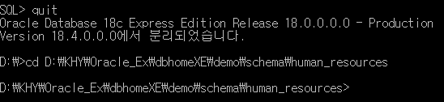

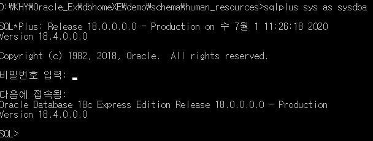

비밀번호는 처음 SQL 설치했을 때 설정했던 시스템 디비의 비밀번호(1234)

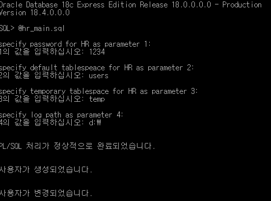

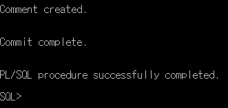

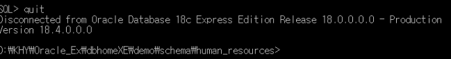

새로운 sqlplus 실행

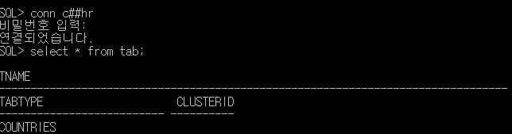

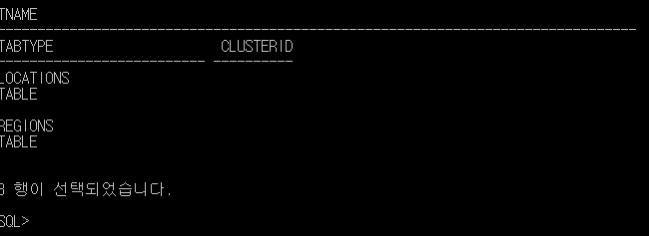

비밀번호 1234 (처음 시스템 비번)

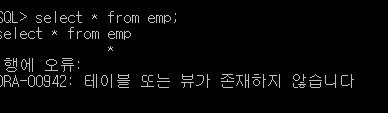

시스템별로 각기 다른 권한을 갖고 있으므로 다른 테이블 검색이 되지 않음

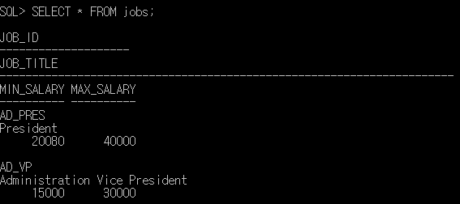

구조 확인

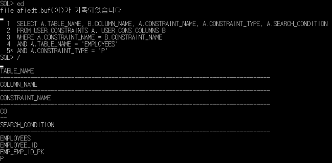

