CMD로 실행 및 로그인

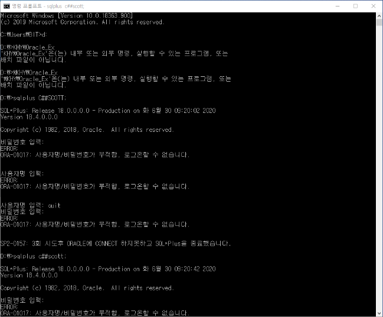

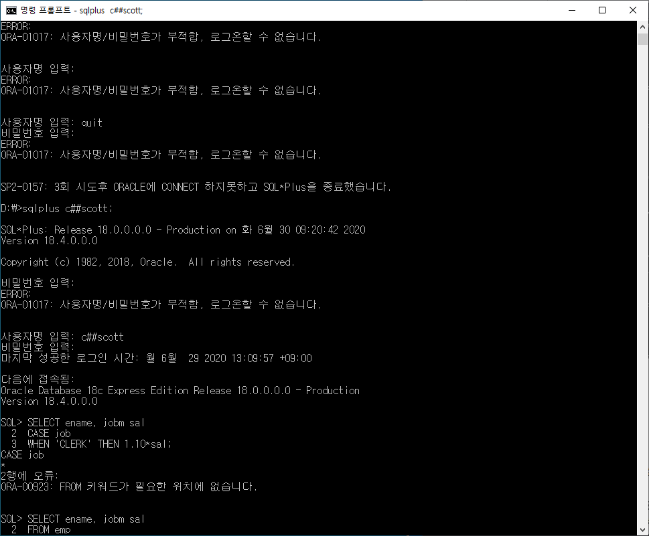

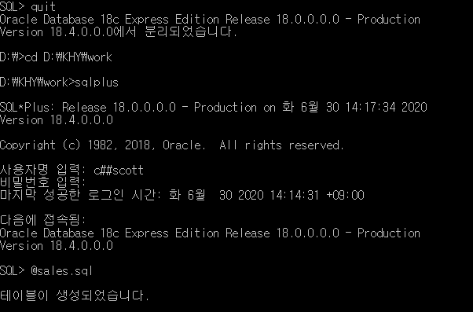

Condition Express

-CASE

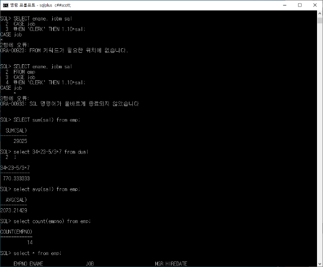

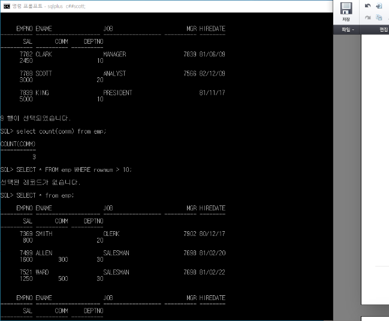

-DECODE

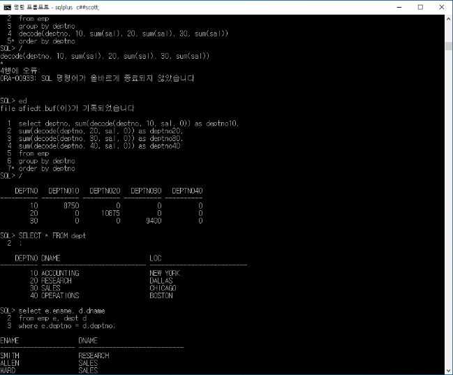

-Aggregation Function

-그룹 함수를 쓸 때 그룹핑을 하고 싶은 필드는 전부 group by로 묶어줘야 함(순서 또한 영향을 줌)

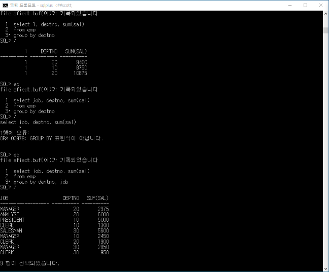

-group by에 조건을 추가로 하고 싶으면 having 씀

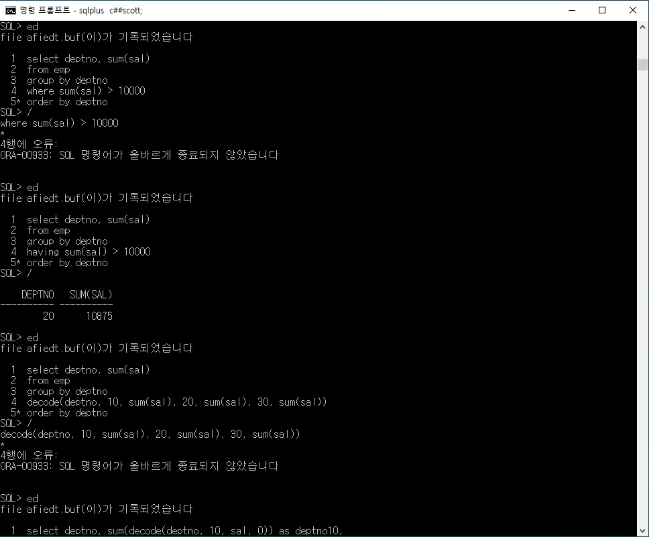

굳이 부서 번호와 실제 사원 디비를 따로 관리하는 이유: 부서명이 바뀔 경우 전체 사원 디비에 부서명이 존재하는 디비라면 전체를 바꿔야되는 부분이 있기 때문에 부서 번호를 따로 디비로 저장

JOIN\*\*\*\*\*

-둘 이상의 테이블을 합쳐 하나의 큰 테이블로 만드는 방법(로지컬)

-필요성: 정규화, Foreign Key, 정규화 된 테이블로부터 결합된 현태의 정보 추출 필요 존재(join)

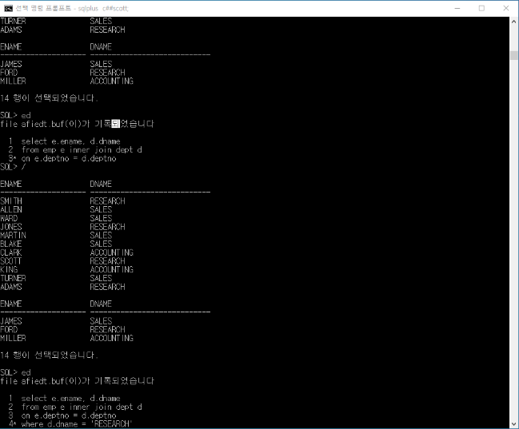

카티젼 프로덕트

-Cross Join

-올바른 join 조건을 where 절에 부여할 필요 있음

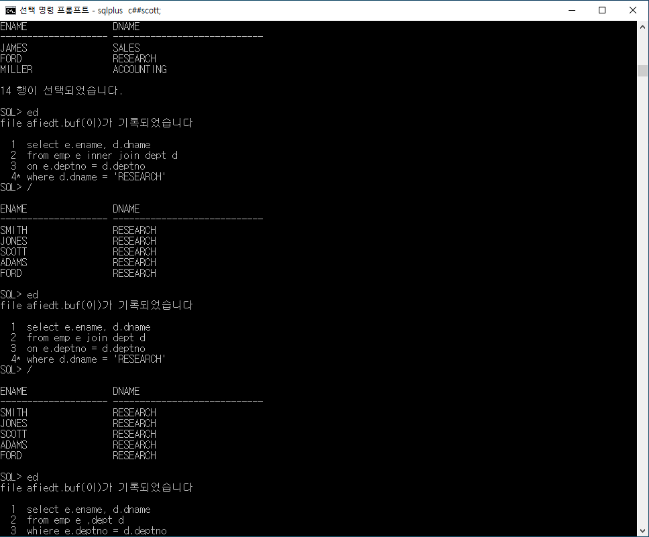

Simple Join

-Syntax

-join 처리방법

Join 종류

-Cross join

-inner join

-outer join

-theta join: 조건(부등호 등)에 의한 조인

-equi-join

-natural join

-self join

Equi-Join(같다라고 표현해서)

-inner

-on

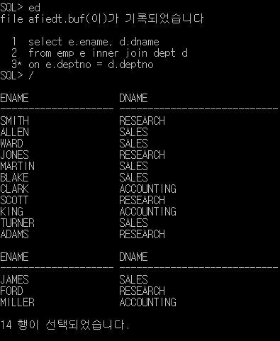

-신표준 구표준 둘 다 알아야 됨

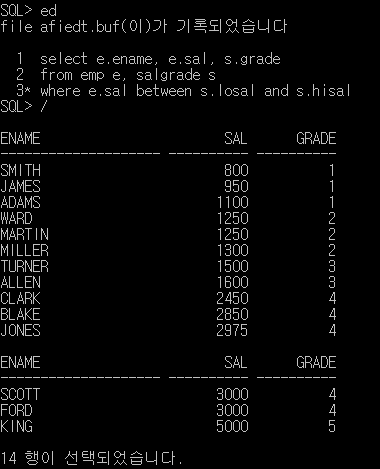

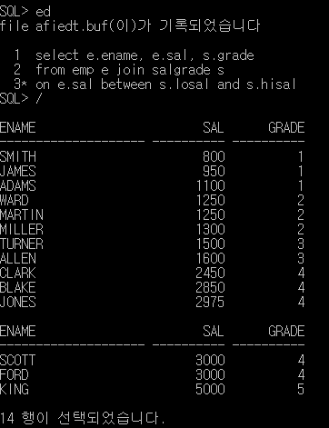

Theta Join

-정의

-Non-Equi Join이라고도 함

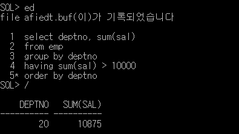

Outer join

-right outer join: 조인 양 옆으로 테이블이 있으므로 그 중 오른쪽에 안나오는 놈들까지 출력하게 만듦(left 동일)

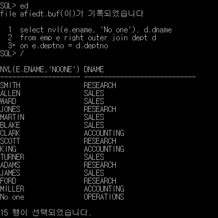

-예전 표기법도 함께 알아야 함(+기호가 헷갈리므로 인지 필요)

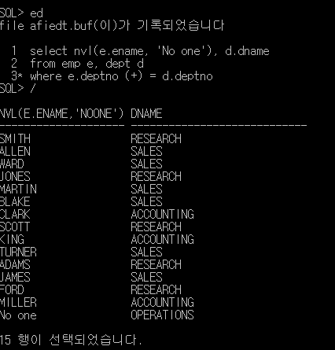

Self Join

-자기 자신과 Join

-Alias를 사용할 수 밖에 없음

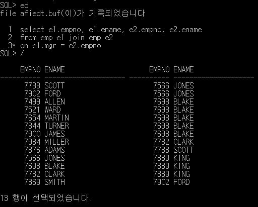

\* e1: 직원, e2: 매니저 / 하지만 mgr 번호가 없는 사장은 안 나옴

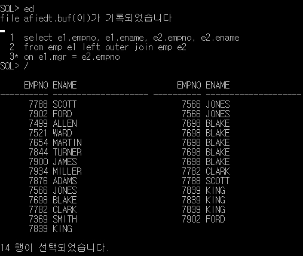

\* outer를 통해 사장까지 데이터 출력

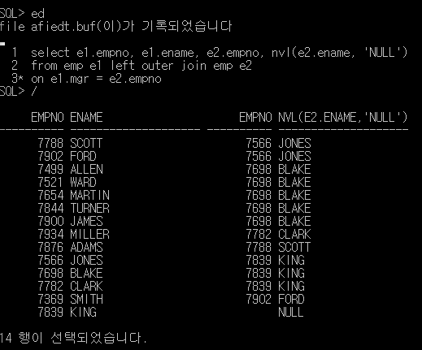

SQL:1992 Syntax

-From절에서 바로 Joi 명시적으로 정의

집계함수

-여러행으로 부터 하나의 결과값 반환

-종류

-group by, order by

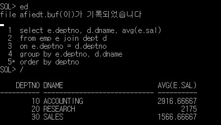

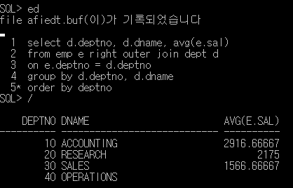

단일 SQL 작성법

\- 최종 출력될 정보에 따라 원하는 컬럼 select 절에 추가

\- 원하는 정보 가진 테이블들을 from 절에 추가

\- where절에 알맞은 join 조건 추가

\- where절에 알맞은 검색 조건 추가

\- 필요에 따라 group by, having 등을 통해 grouping

\- 정렬 조건 order by 추가

ROLLUP & CUBE (안 중요)

\- rollup(a, q)

\- cube(a, b)

\- grouping(expr...)

3\. SUBQUERY

\- 하나의 쿼리 질의문 속에 다른 쿼리 질의문이 포함된 상태

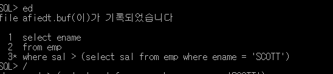

Single-Row Subquery

\- 서브쿼리의 결과가 한 ROW인 경우

\- Single-Row Operator 사용해야 함: >, <....

Multi-Row Query

\- Subquery의 결과가 둘 이상의 Row

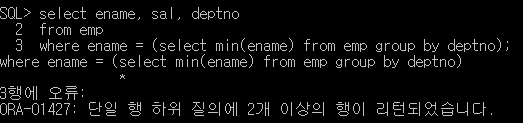

\- Multi-Row에 대한 연산을 사용해야 함: ANY, ALL, IN, ....

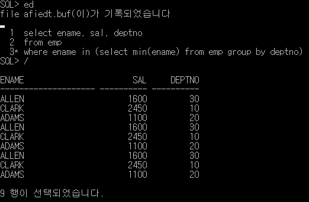

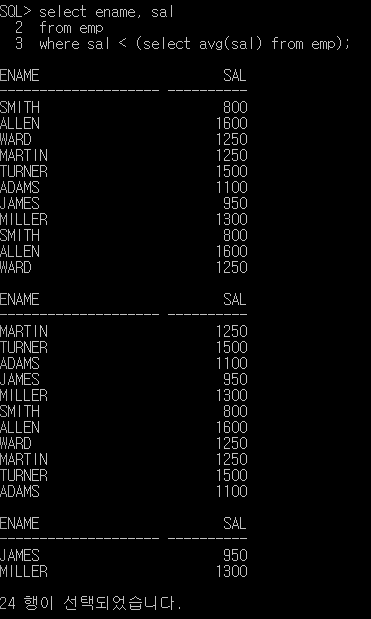

Correlated Query

\- 안에 있는 서브쿼리는 밖의 서브 쿼리를 참조 가능

\- Outer Query와 Inner Query가 서로 연관되어 있음

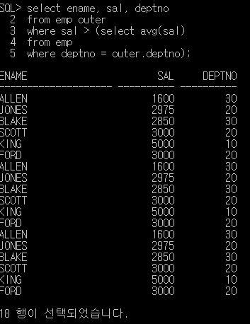

\* 밖의 outer는 Alias, 밖의 테이블에서 하나 씩 꺼내와 괄호 안의 서브 쿼리를 돌리는 방식

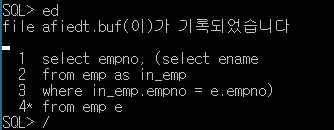

\* 서브쿼리 형태의 위치는 쓰기 나름임

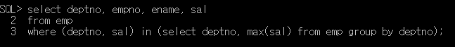

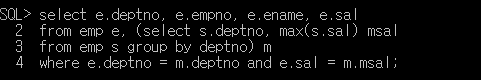

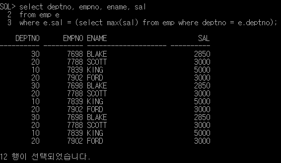

\* 세 가지 모두 같은 결과(2번의 경우 inline 뷰까지 사용, 특히 from 절에 있는 서브쿼리문은 무조건 인라인 뷰 / 시험 안 나옴)

TOP-K QUERY(오라클)

\- 조건을 만족하는 상위 k개의 결과를 빨리 얻기

\- ROWNUM: 질의의 결과에 가상으로 부여되는 오라클의 슈도 컬럼

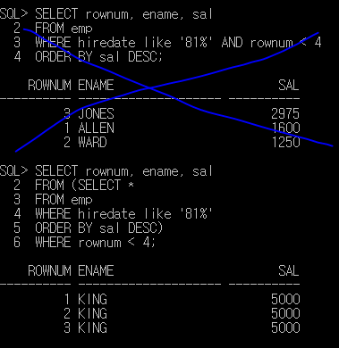

SET Operator

\- 두 질의의 결과를 가지고 집합 연산

\- UNION(컬럼의 갯수와 타입만 맞으면 연산 가능), UNION ALL, INTERSECT, MINUS

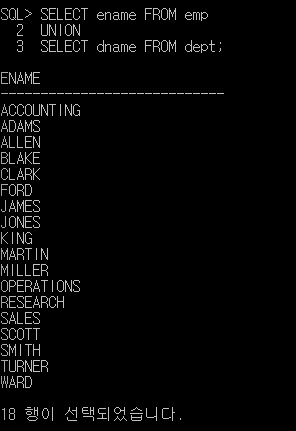

RANK 관련 함수

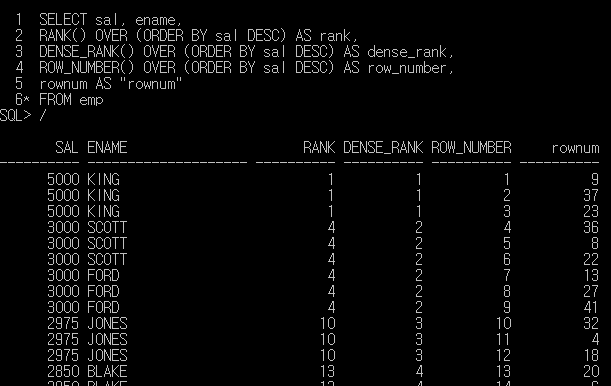

1\. DDL

DDL 요약

\- CREATE TABLE : 테이블 생성

\- ALTER TABLE : 테이블 관련 변경

\- DROP TABLE : 테이블 삭제

\- RENAME : 이름 변경

\- TRUNCATE : 테이블의 모든 데이터 삭제

\- COMMENT

테이블 생성

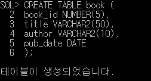

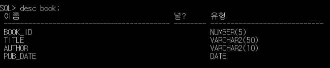

Subquery를 이용한 테이블 생성

\- Subquery의 결과와 동일한 테이블 생성됨

\- 질의 결과 레코드들이 포함 됨

\- NOT NULL 제약 조건만 상속됨

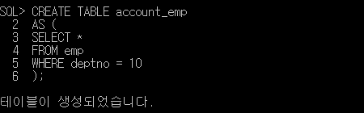

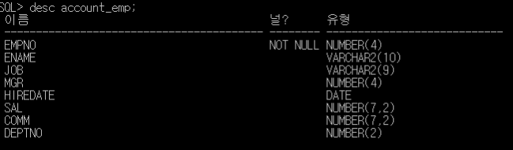

Naming Rules

\- 테이블 컬럼 등의 이름 명명 규칙

TABLE 종류

\- User TAbles

\- Data Dictionary

기본 데이터 타입

ALTER TABLE

\- 컬럼추가

\- 컬럼 수정

\- 컬럼 삭제

\- UNUSED 컬럼

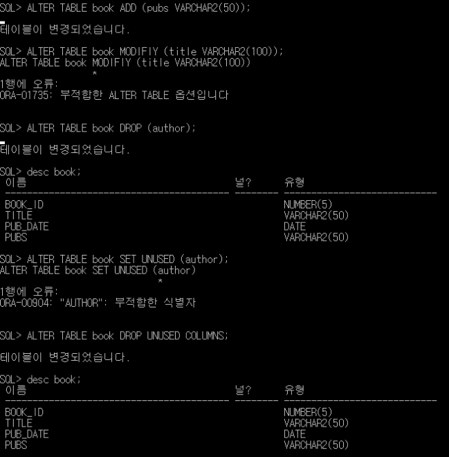

기타 테이블 관련 명령

\- 테이블 삭제

\- 데이터 삭제

\- Comment

\- RENAME

\- ROLLBACK 대상이 아니다

제약조건

\- Constraint

\- 종류 : NOT NULL, UNIQUE, PRIMARY KEY, FOREIGN KEY, CHECK

제약조건 정의

\- Syntax

\- 주의 : 제약 조건에 이름을 부여하지 않으면 오라클이 Sys-Cn 형태로 자동 부여

제약조건

\- NOT NULL

\- UNIQUE

\- PRIMARY KEY (NOT NULL + UNIQUE)

\- CHECK : 임의의 조건 검사(조건식이 참이어야 변경 가능)

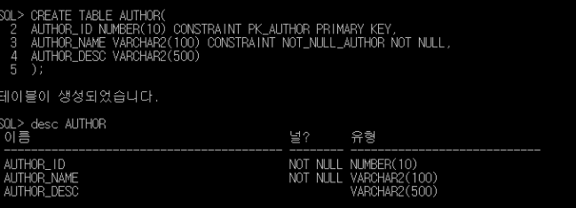

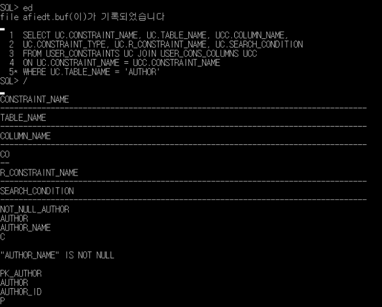

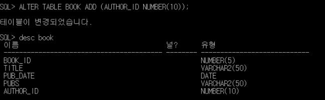

제약조건

\- FOREIGN KEY (ON DELETE CASCADE, ON DELETE ...) 

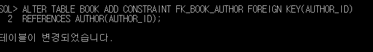

\* 물리적으로 외래키에 대한 제약조건 작성 (제약조건에 대한 이름이 없으면 전부 Sys.. 식으로 자동으로 넣어버림)

ADD / DROM CONSTRAINS

\- 제약조건 추가

\- 제약조건 삭제

제약조건 타입

'P' : 'PRIMARY KEY'

'U' : 'UNIQUE KEY'

'C' : 'CHECK'

'R' : 'FOREIGN KEY'

Data Dictionary

\- 기존에 sql DB를 중복 실행시켰을 경우 해당 테이블을 삭제 후 다시 테이블을 생성하여 설정해야 됨

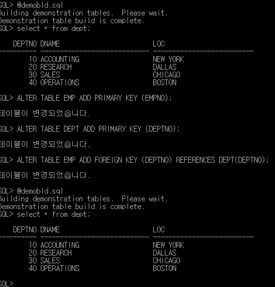

GRANT / REVOKE

권한확인

