<https://mine-it-record.tistory.com/44>

ERD(Entity Relation Diagram)

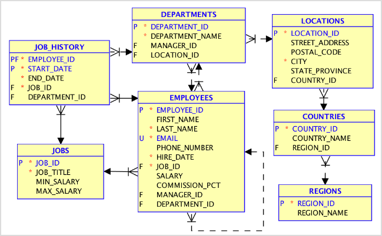

\*ERD 기호들 확인

실선 : 1 대 N (N은 최소 1개)

점선 : 1대 0 or N

스타 : NOT NULL

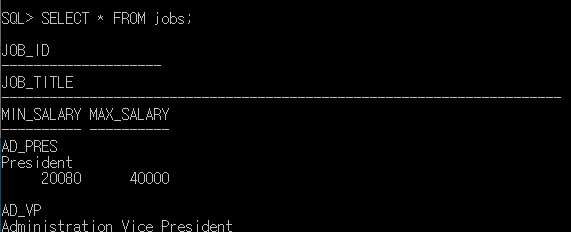

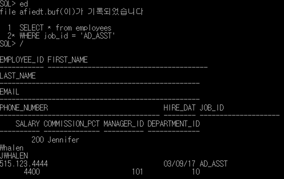

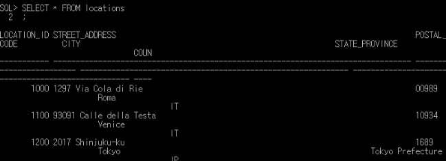

실습

1\. 사원 이름을 입력 받아 사원 정보를 검색하는 프로그램을 작성

\- 부분 이름 검색이 가능

\- 성, 이름 칼럼에 대해 OR 검색이 돼야함

\- 출력 사원 정보는 이름 성, 이메일, 전화번호, 입사일

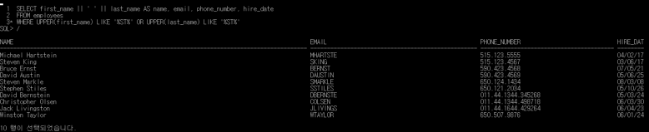

사용자로부터 최소 봉급과 최대 봉급을 입력받아(최소 7000 ~ 최대 15000) 봉급이 해당 범위 내에 속하는 사원의 정보를 출력하는 프로그램 작성(정렬은 salary가 작은 순서)

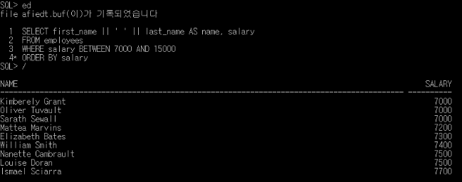

3\. 각 부서(department\_id)별로 최고 연봉(salary)를 받는 사원의 부서(department\_id), 사원의 사번(employee\_id), 성(last\_name)과 연봉(salary)을 조회하라(단, 조회결과는 연봉의 내림차순으로 정렬되어 나타나야 함)

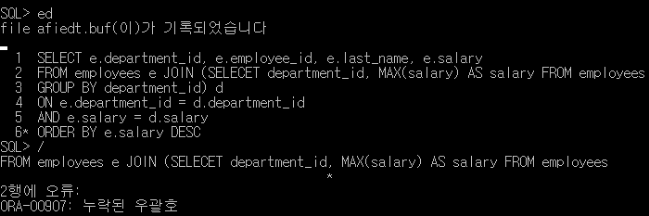

PL/SQL

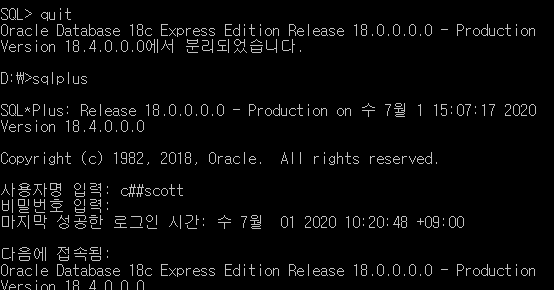

\* scott 계정으로 로그인

\* 이렇게 안 하면 결과가 안 나옴(항상 켜주는 습관)

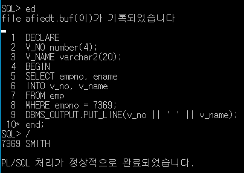

\* PLSQL에선 END에 반드시 세미콜론; 이 있어야 함

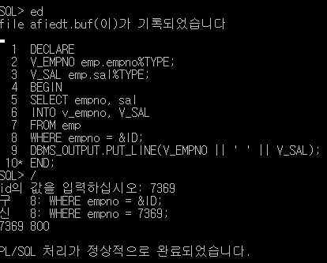

\* emp.empno%TYPE은empno의 타입을 그대로 가져다 쓴다는 뜻

\* id값은 실제 존재하는 i 입력

<커서>

특정 SQL 문장을 처리한 결과를 담고 있는 영역을 가리키는 일종의 포인터

커서를 사용하면 처리된 SQL 문장의 겨로가 집합에 접근할 수 있음

\- 묵시적 커서

오라클 내부에서 자동으로 생성되어 사용하는 커서

PL/SQL 블럭에서 DML문장이 실행될 때마다 자동으로 생성

SQL%FOUND : 결과집합의 패치 RO 수가 1개 이상 TRUE, 아니면 FALSE

SQL%NOTFOUND : 결과집합의 패치 ROW 수가 0이면 TRUE, 아니면 FALSE

SQL%ROWCOUNT : 영향받은 결과 집합 ROW 수, 없으면 0

SQL%ISOPEN : 묵시적 커서는 항상 FALSE(묵시적 커서는 실행문 종료 후 바로 닫힘)

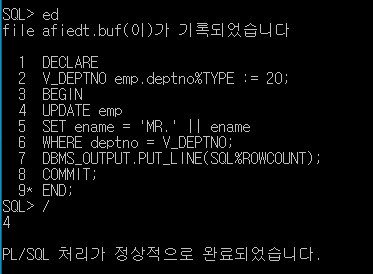

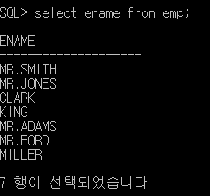

\- 명시적 커서

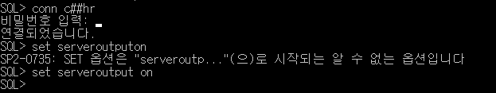

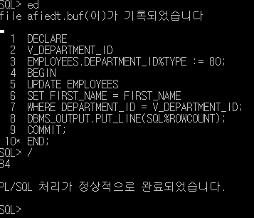

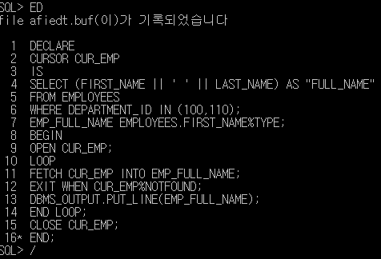

\* 정의 - 오픈 - 페치 - 클로즈

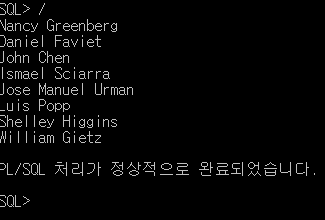

함수

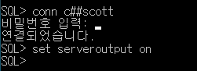

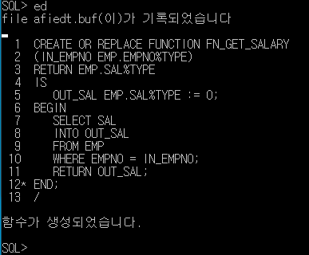

\* 가장 최근 오류를 보여주는 명령어

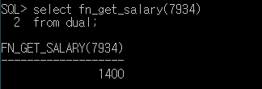

\* 함수 삭제는 DROP FUNCTION

저장 프로시저(stored-procedure)

함수는 반드시 리턴값이 있어야 되지만 해당 프로시저는 리턴이 없어도 됨

\- 단일 프로시저

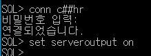

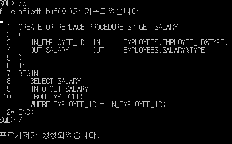

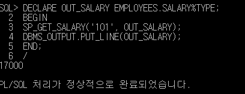

커서 패키지

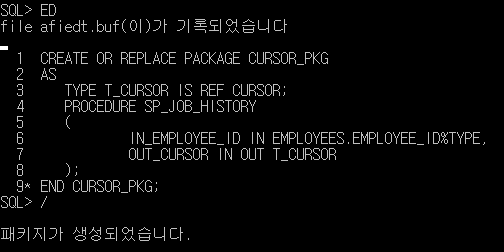

\* 패키지 헤더 부분

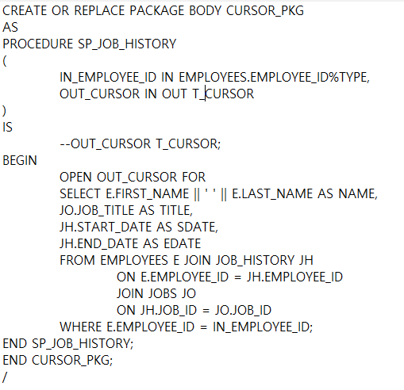

\* 패키지 바디 부분

\* -- : 주석

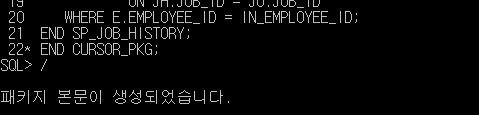

\* pakage.txt에 헤더와 바디 부분 참조
