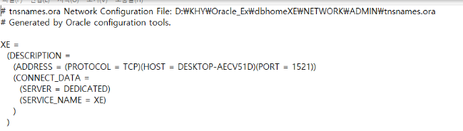
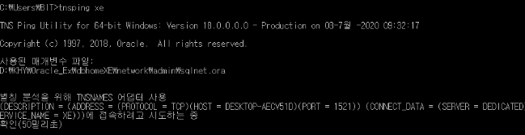
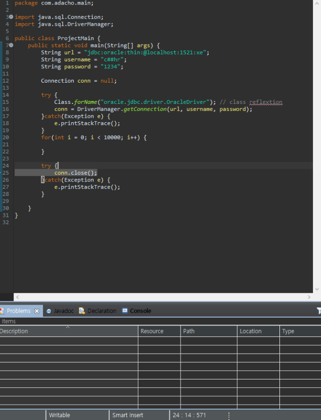
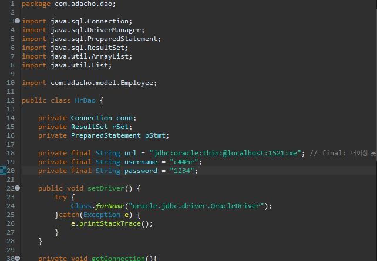
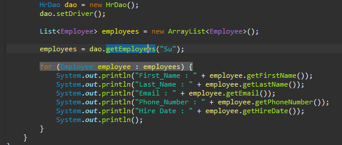
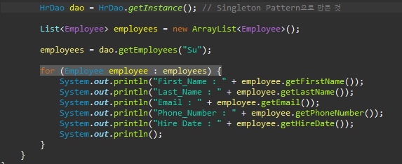
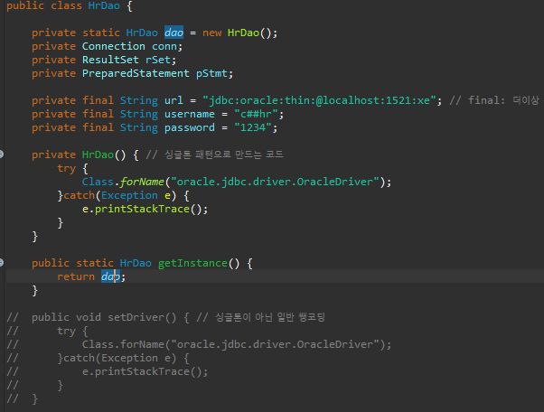

JAVA로 DB 만들고 관리

JDBC(Java DataBase Connective)

\- Interface(구현 내용 알아서, 규격은 정해진 채로)로 되어있음

\- 구현 클래스를 만들어 Driver 형태로 사용(DBMS의 형태에 따라 다르므로)

.jar : 패키지들을 모아놓은 것

jdk-14.0.1로 프로젝트 파일을 만듦 -> 라이브러리에 추가 ojdbc8.jar(클래스파일, 없으면 직접 추가)

자바 서버 접속

\* xe 서버로 접속하겠다

\* SQL 연결과 예외처리 기본 화면

DAO(Data Access Object)

\* HrDAO.java 클래스

\* HrMain.java 클래스

\- DAO 클래스에서 드라이버 및 데이터 접근 등을 구현

\- Main 클래스에서 실행만 함

Singleton Pattern으로 만들기

\* HrMain

\*

\* HrDao 클래스

\- 클라이언트 입장에선 1회에 1번의 명령만 실행하므로 위와 같은 싱글톤 패턴으로 작성하는 것이 가능

Singleton Pattern으로 만들기

